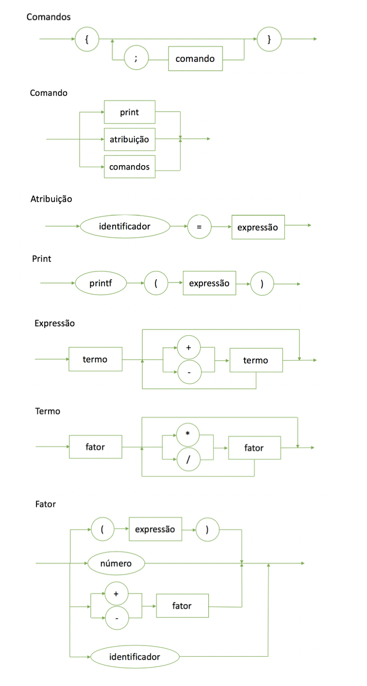

# LogComp

### Diagrama Sintático

### EBNF:
```
comandos = “{”, comando, “;”, { comando, “;” }, “}” ;
comando = atribuição | comandos | print;
print = printf, “(”, expressão, “)” ;
atribuição = identificador, “=”, expressão ;
expressão = termo, { (“+” | “-”), termo } ;
termo = fator, { (“*” | “/”), fator } ;
fator = (“+” | “-”), fator | número | “(”, expressão, “)” | identificador ;
printf = "printf";
identificador = letra, { letra | digito | “_” } ;
número = dígito, { dígito } ;
letra = ( a | ... | z | A | ... | Z ) ;
dígito = ( 1 | 2 | 3 | 4 | 5 | 6 | 7 | 8 | 9 | 0 ) ;
```
